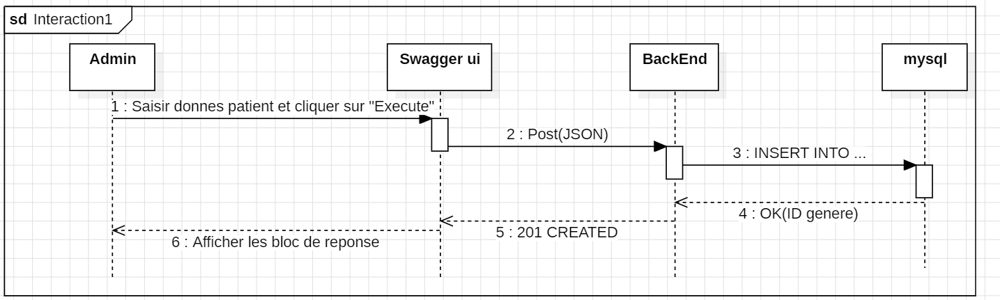
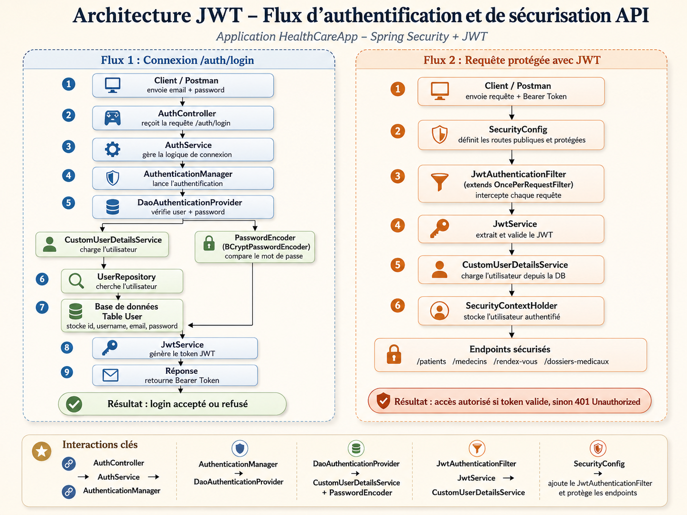

# HealthCare-

Ce projet consiste à développer une API REST pour la gestion d’un système médical dans le cadre de la transformation numérique d’une entreprise HealthCare+.

L’application permet de gérer efficacement :

les patients
les médecins
les rendez-vous
les dossiers médicaux

L’objectif est de proposer une architecture claire, maintenable et conforme aux bonnes pratiques du développement backend avec Spring Boot.

Technologies utilisées
Java 17 / 21
Spring Boot
Spring Data JPA / Hibernate
Flyway (gestion des migrations)
MySQL / H2 (tests)
MapStruct (mapping DTO ↔ Entity)
Lombok
Swagger (documentation API)
Maven
Docker

Architecture

Le projet suit une architecture MVC :

Controller → gestion des requêtes HTTP
Service → logique métier
Repository → accès aux données
DTO → transfert de données
Mapper → conversion Entity ↔ DTO (MapStruct) 

#securité

Rôles

L’application gère trois rôles :

ADMIN
MEDECIN
PATIENT

Chaque rôle possède des permissions spécifiques.

Contrôle d’accès

L’API utilise une autorisation basée sur les rôles :

ADMIN peut gérer les utilisateurs, patients, médecins, rendez-vous et dossiers médicaux.
MEDECIN peut accéder uniquement aux données liées à son activité.
PATIENT peut accéder uniquement à ses propres informations, rendez-vous et dossier médical.
Endpoints personnels sécurisés

GET /patients/me
GET /medcins/me
GET /dossiers/me
GET /rendezvous/me

Ces endpoints utilisent l’utilisateur authentifié à partir du token JWT afin de retourner uniquement les données appartenant à l’utilisateur connecté.

Filtre JWT

Un filtre JWT personnalisé intercepte chaque requête HTTP :

Extraction du token depuis le header Authorization
Validation du token
Chargement de l’utilisateur authentifié
Ajout de l’utilisateur dans le contexte Spring Security

Cela permet de sécuriser automatiquement les endpoints protégés.

Pagination

L’application supporte la pagination grâce à Spring Data Pageable.

                     #Lancement du projet
1. Cloner le projet

git clone <repo-url>

Lancer MySQL (Docker)

docker run -d --name healthcare-mysql \
-e MYSQL_ROOT_PASSWORD=123456 \
-e MYSQL_DATABASE=healthcare \
-p 3306:3306 mysql:8.0

Lancer l’application   

mvn spring-boot:run 

Tester l’API
Swagger :

http://localhost:8080/swagger-ui.html    